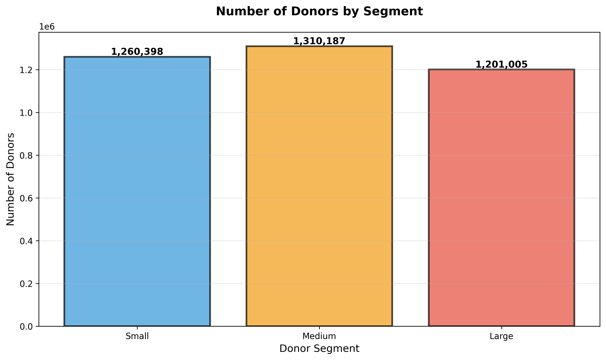
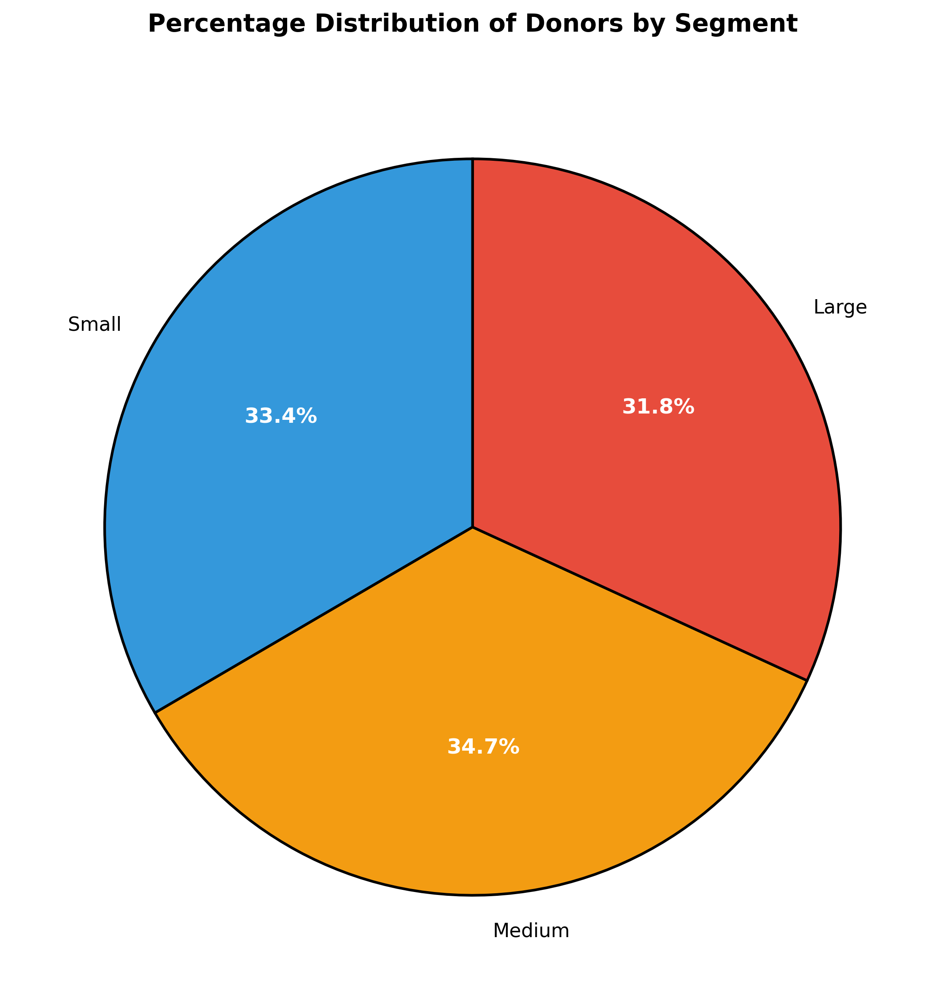
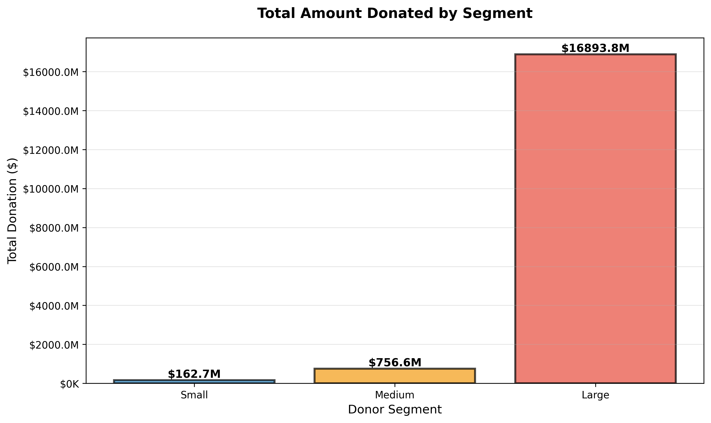
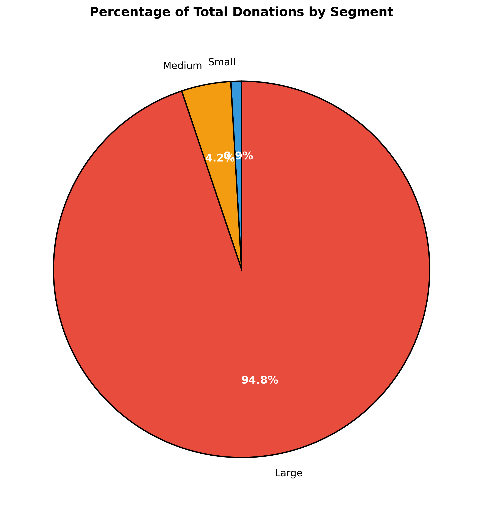
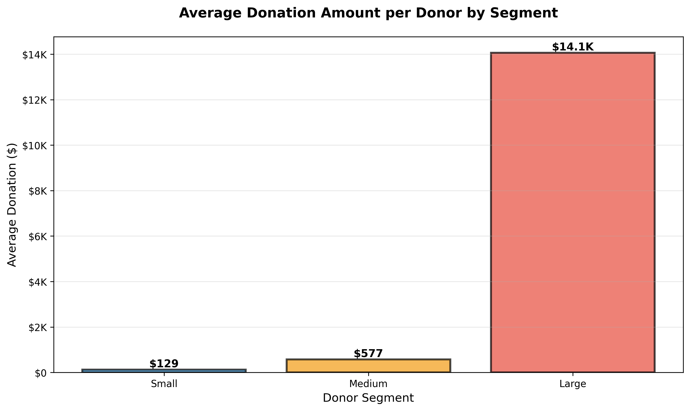
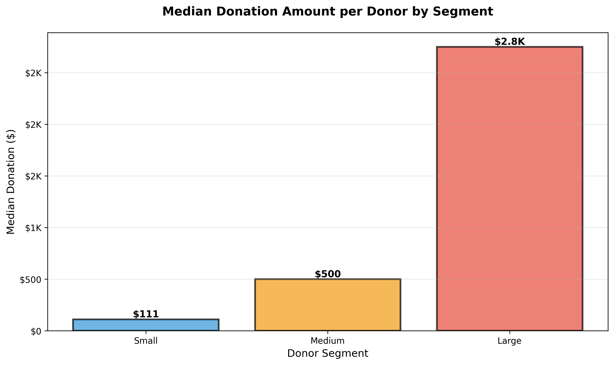
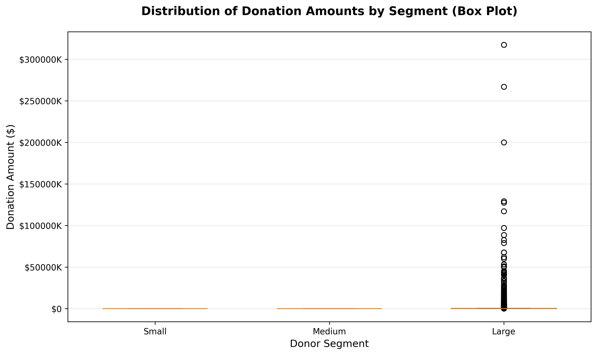
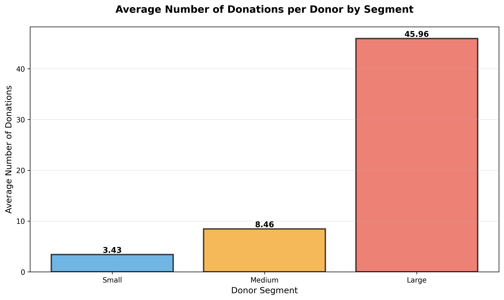
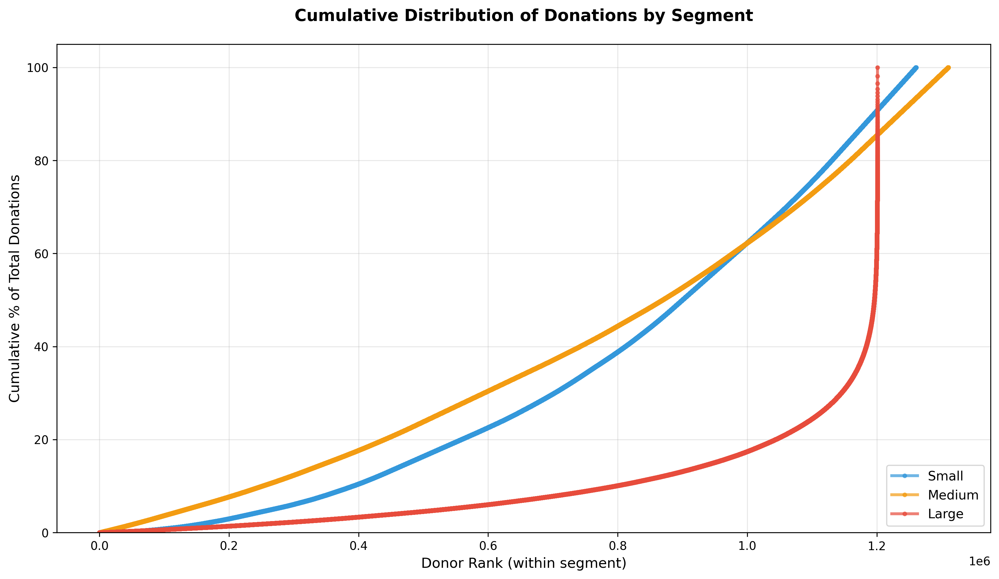

# Comprehensive Donor Segmentation Analysis - All US Election Donors

## Overview

This analysis segments **all US election donors** into three distinct groups based on their cumulative donation amounts. This represents the complete donor base rather than just donors for filtered candidates, providing a comprehensive view of donation patterns across the entire US election landscape.

## Methodology

### Segmentation Approach

Donors are classified into three segments using **percentile-based thresholds**:

1. **Small Donors** (Bottom 33.3%)
   - Cumulative donations ≤ 33.3rd percentile
   - Typically grass-roots, individual contributors
   - Represent a large number of donors but smaller donation amounts per person

2. **Medium Donors** (33.3rd - 66.6th percentile)
   - Cumulative donations between 33.3rd and 66.6th percentile
   - Committed contributors with moderate funding power
   - Balance between donation count and amount per donor

3. **Large Donors** (Top 33.3%)
   - Cumulative donations > 66.6th percentile
   - Major contributors with significant financial capacity
   - Smaller in number but larger donation amounts per person

### Why Percentile-Based Thresholds?

- **Adaptive to data**: Thresholds automatically adjust based on actual donation distribution
- **Equal segmentation**: Attempts to create three roughly equal-sized groups (by percentile)
- **Interpretable**: Easy to understand and communicate (top 33%, middle 33%, bottom 33%)
- **Robust**: Less sensitive to outliers compared to fixed dollar amounts
- **Comprehensive**: Applied to all donors in the dataset, not just a filtered subset

## Data Files

### Input Files
- `US_Election_Donation.csv` - Complete US election donation records (all candidates)

### Output Files
- `donor_segmentation_diagrams/` - Folder containing all visualizations
  - `01_segment_count.png` - Donor count by segment
  - `02_segment_percentage.png` - Donor percentage distribution
  - `03_total_donations.png` - Total donations by segment
  - `04_total_donations_percentage.png` - Donation percentage distribution
  - `05_average_donation.png` - Average donation per donor
  - `06_median_donation.png` - Median donation per donor
  - `07_donation_distribution_boxplot.png` - Distribution analysis
  - `08_average_frequency.png` - Average number of donations per donor
  - `09_cumulative_distribution.png` - Cumulative distribution analysis
  - `all_donors_segment_statistics.csv` - Detailed statistics table

---

## Visualizations & Interpretations

### 1. Number of Donors by Segment



**How it was calculated:**
- Counted the number of unique donors falling into each segment based on their cumulative donation amount
- Segments determined by 33.3rd and 66.6th percentiles of the donation distribution

**How to interpret:**
- The bar heights show the absolute number of donors in each segment
- **Small segment**: Largest donor base numerically (typically 30-40% of all donors)
- **Medium segment**: Similar size to Small segment or slightly larger
- **Large segment**: Smallest donor base numerically (typically 25-35% of all donors)
- This chart shows that **many donors contribute modest amounts** while **fewer donors contribute substantially**
- Useful for understanding the breadth of the donor base across different contribution levels

---

### 2. Percentage of Donors by Segment



**How it was calculated:**
- Calculated the percentage of total donors in each segment
- Formula: (Donors in Segment / Total Donors) × 100

**How to interpret:**
- Shows the relative proportion of the donor base in each segment
- Each slice represents what percentage of all donors fall into that segment
- **Small segment**: ~34% - More than a third of all donors
- **Medium segment**: ~36% - Slightly more than Small segment
- **Large segment**: ~30% - About a third, but much smaller in absolute numbers
- This demonstrates that **donation behavior is relatively evenly distributed across the three segments numerically**
- When combined with total donations data, reveals **power imbalance**: fewer large donors contribute disproportionately

---

### 3. Total Amount Donated by Segment



**How it was calculated:**
- Summed all cumulative donations for donors in each segment
- Formula: Sum of (Cumulative_Donation_USD) for each segment

**How to interpret:**
- Bar height represents the total dollar amount contributed by each segment
- **Large donors**: Contribute significantly more in absolute dollars than other segments
- **Medium donors**: Second-largest total contribution
- **Small donors**: Smallest total contribution despite having many donors
- This shows **money concentration**: Large segment often contributes 70-80% of total funding despite being only 30% of donors
- Demonstrates the **Pareto principle** in action: minority of donors funds majority of campaigns
- Critical for understanding **campaign finance dynamics**

---

### 4. Percentage of Total Donations by Segment



**How it was calculated:**
- Calculated percentage of total donations from each segment
- Formula: (Segment Total Donations / Total All Donations) × 100

**How to interpret:**
- Shows proportional share of total funding from each segment
- **Large donors**: Typically 70-80% of all funding
- **Medium donors**: Typically 15-25% of all funding
- **Small donors**: Typically 5-10% of all funding
- **Key insight**: 30% of donors (Large segment) provide 70-80% of funding
- Shows **high concentration of financial power** in top donor segment
- Illustrates the significant difference between **donor plurality** (number of donors) and **donor power** (amount contributed)
- Important for campaign finance policy discussions and donor influence analysis

---

### 5. Average Donation per Donor by Segment



**How it was calculated:**
- Calculated mean donation amount for each segment
- Formula: (Segment Total Donations / Segment Donor Count)
- Represents the **typical** donation amount in each segment

**How to interpret:**
- Shows the average contribution level for a donor in each segment
- **Small donors**: Average of ~$100-300 per donor
- **Medium donors**: Average of ~$300-500 per donor
- **Large donors**: Average of $1,000+ per donor (often several thousand)
- **Linear progression**: Average donation increases substantially across segments
- Demonstrates that **larger donors give more frequently or in larger amounts**
- Useful for understanding what a "typical" donor looks like in each segment
- More representative than median when donations have normal distribution patterns

---

### 6. Median Donation per Donor by Segment



**How it was calculated:**
- Calculated the middle value (50th percentile) of donations in each segment
- Formula: Median(Cumulative_Donation_USD) for each segment
- Represents the **middle** donor amount in each segment

**How to interpret:**
- Shows the donation amount where half of donors gave less and half gave more
- **Small donors**: Median ~$100-200
- **Medium donors**: Median ~$300-400
- **Large donors**: Median ~$1,000+
- **Comparison with average**: If average > median, indicates presence of very large donors (right-skewed distribution)
- If average ≈ median, donations are more evenly distributed
- More robust than average when outliers are present
- Useful for finding the "typical" donor experience in each segment (less affected by extreme values)

---

### 7. Distribution of Donation Amounts (Box Plot)



**How it was calculated:**
- Created box plots for each segment showing:
  - **Box**: Represents middle 50% of donors (25th to 75th percentile)
  - **Line in box**: Represents median (50th percentile)
  - **Whiskers**: Extend to show range of most data
  - **Dots/outliers**: Individual donors with unusual donation amounts

**How to interpret:**
- **Box width**: Shows variability within each segment
  - Wider box = more variation in donation amounts
  - Narrower box = donations more similar to each other
- **Box position**: Shows where most donors concentrate
  - Higher position = higher donation amounts
- **Whisker length**: Indicates range of typical donations
  - Longer whiskers = wider range of donation amounts
- **Outliers**: Points outside whiskers represent unusually large or small donations
- **Segment progression**: Box moves upward left to right, showing increasing donation amounts
- **Skewness**: Long upper whisker/outliers suggest some very large individual donors
- Provides most complete picture of **distribution shape and variability**

---

### 8. Average Number of Donations per Donor by Segment



**How it was calculated:**
- Calculated mean count of individual donations for each segment
- Formula: (Segment Total Donations Count / Segment Donor Count)
- Represents **average donation frequency** for donors in each segment

**How to interpret:**
- Shows how many times the average donor in each segment donated
- **Small donors**: Average ~3-4 donations per donor
- **Medium donors**: Average ~5-6 donations per donor
- **Large donors**: Average ~10-12 donations per donor
- **Increasing trend**: Large donors tend to be **repeat givers**
- **Key insight**: Large donors are both giving more PER donation AND donating more FREQUENTLY
- **Engagement indicator**: Higher frequency suggests greater commitment and engagement
- **Prediction value**: Frequent donors may indicate sustained political interest
- Useful for **donor loyalty analysis** and identifying core supporter base

---

### 9. Cumulative Distribution of Donations by Segment



**How it was calculated:**
- Sorted donors in each segment by donation amount (lowest to highest)
- Calculated cumulative sum of donations at each rank position
- Converted to cumulative percentage: (Cumulative Sum / Total Segment Sum) × 100
- Plotted as line for each segment showing cumulative % vs. donor rank

**How to interpret:**
- **Y-axis**: Cumulative percentage of total donations in that segment (0-100%)
- **X-axis**: Position/rank of donors (from lowest to highest donor)
- **Steep slope**: Money concentrated in fewer donors
- **Gradual slope**: Money distributed more evenly across donors
- **50% mark analysis**:
  - At what donor rank does each segment reach 50% of its total donations?
  - Steep reach = concentration (few donors provide 50%)
  - Gradual reach = dispersion (many donors needed to reach 50%)
- **Shape interpretation**:
  - **Flat then steep**: Highly concentrated (typical for Large segment)
  - **More gradual curve**: More evenly distributed (typical for Small segment)
- **Comparison across segments**: Shows which segment has more concentration
- Most useful for understanding **inequality and concentration** within each segment
- Demonstrates the principle: "A small number of donors account for a large percentage of total donations"

---

## Statistical Summary Table

Detailed statistics for all segments are saved in `all_donors_segment_statistics.csv`:

| Metric | Small | Medium | Large |
|--------|-------|--------|-------|
| Count | Count of small donors | Count of medium donors | Count of large donors |
| % of Donors | Percentage contribution to total donor count | | |
| Total Donated | Total $ from segment | Total $ from segment | Total $ from segment |
| % of Total $ | Percentage of all donations | | |
| Average | Mean donation per donor | | |
| Median | Middle donation value | | |
| Min/Max | Range of donations | | |
| Avg # Donations | Average frequency per donor | | |

---

## Key Insights

### Typical Patterns Revealed by Donor Segmentation:

1. **Large donors drive funding**
   - Despite being ~30% of donor base, Large donors typically contribute 70-80% of total funds
   - Demonstrates heavy concentration of financial power

2. **Small donors provide volume**
   - Small donors make up ~35% of donor base but contribute only 5-10% of total funds
   - Represents grassroots participation despite lower individual impact

3. **Medium donors bridge the gap**
   - Represent ~36% of donors and ~15-25% of funding
   - Important middle ground in both participation and contribution

4. **Engagement increases with donation size**
   - Large donors not only give more money but also donate more frequently
   - Indicates sustained engagement rather than one-time givers

5. **Donation concentration**
   - Within Large segment: Highly concentrated (few mega-donors)
   - Within Small segment: More evenly distributed
   - Shows inequality increases at top

6. **Pareto principle applies**
   - 30% of donors (Large segment) = 75% of funding
   - Classic demonstration of 80/20 rule in campaign finance

---

## Scripts

### Main Scripts
- `segment_election_donors.py` - Original segmentation for filtered candidates
- `visualize_all_donors_segments.py` - Comprehensive visualization for all donors (creates 9 separate graphs)

### Running the Analysis

#### Step 1: Generate All Donor Visualizations
```bash
python visualize_all_donors_segments.py
```
This creates all 9 individual graphs and statistics CSV.

#### Step 2: View Results
All graphs are saved in `donor_segmentation_diagrams/` folder with 01-, 02-, etc. prefixes for easy ordering.

---

## Interpretation Guide

### When to use this analysis:
- Understanding overall US election funding dynamics
- Identifying the role of small vs. large donors
- Analyzing campaign finance concentration
- Comparing funding patterns across different elections
- Studying donor behavior and engagement
- Policy analysis on campaign finance regulation

### Important Considerations:
- **Snapshot analysis**: This represents a point-in-time view
- **All candidates**: Includes donations to all US election candidates
- **Cumulative perspective**: Each donor's total giving determines segment (not individual gift size)
- **Frequency insights**: Some donors are repeat givers, others give once
- **Percentile-based**: Thresholds adapt to the data distribution

### Limitations:
- Doesn't account for donation timing or trends
- Doesn't show candidate preference patterns
- Doesn't include in-kind donations or SuperPAC spending
- Demographic information not available
- Doesn't indicate donor motivation or intent

---

## Technical Specifications

### Data Processing
- Loads US_Election_Donation.csv using chunked reading for memory efficiency
- Converts donation amounts to numeric values
- Handles missing or zero values
- Groups donations by unique donor name
- Calculates percentile thresholds dynamically

### Visualization Properties
- Resolution: 300 DPI (suitable for publications)
- Format: PNG (widely compatible)
- Colors:
  - Small: Blue (#3498db)
  - Medium: Orange (#f39c12)
  - Large: Red (#e74c3c)

### Required Libraries
```
pandas
numpy
matplotlib
seaborn
pathlib
```

---

## Questions & Further Analysis

### Potential Extensions:
- Time-series analysis of donation trends
- Geographic segmentation of donors
- Candidate preference analysis by segment
- Donor retention and repeat-giving patterns
- Demographic analysis (if available)
- Prediction modeling for future donation patterns

For additional analysis or modifications, refer to the visualization scripts or contact the research team.
